# AutoStack — Automated 2-Tier AWS Deployment Pipeline with Terraform & Jenkins

A fully automated cloud infrastructure project that provisions AWS resources using Terraform and deploys a containerized 2-tier web application (Flask + MySQL) via a Jenkins CI/CD pipeline running inside Docker.

---

## Architecture Overview

```
Developer → GitHub → Jenkins (Docker) → Docker Compose → Flask + MySQL
                ↑
           Terraform
    (VPC, EC2, SG, IGW, Subnet)
```

Every `git push` to the `main` branch automatically triggers Jenkins, which builds the Docker image and redeploys the application — zero manual intervention.

---

## Tech Stack

| Layer | Tool |
|---|---|
| Infrastructure | Terraform |
| Cloud Provider | AWS (EC2, VPC, Subnet, IGW, Security Group) |
| CI/CD | Jenkins (Dockerized) |
| Application | Python Flask |
| Database | MySQL 8.0 |
| Containerization | Docker + Docker Compose |
| Version Control | GitHub |
| OS | Ubuntu 22.04 LTS |

---

## Project Structure

```
2-tier-flask-app/
├── terraform/
│   ├── main.tf            # VPC, EC2, SG, IGW, Key Pair, Subnet
│   ├── variables.tf       # Input variables (region, AMI, instance type)
│   ├── outputs.tf         # EC2 IP, Jenkins URL, Flask URL
│   └── user_data.sh       # Auto-installs Docker, Swap, Jenkins on EC2 boot
└── app/
    ├── app.py             # Flask application
    ├── Dockerfile         # Flask container image
    ├── docker-compose.yml # Flask + MySQL orchestration
    ├── Jenkinsfile        # CI/CD pipeline definition
    ├── requirements.txt   # Python dependencies
    └── templates/
        └── index.html     # Frontend UI
```

---

## Infrastructure (Terraform)

Custom AWS networking built from scratch — no default VPC used.

| Resource | Details |
|---|---|
| VPC | `10.0.0.0/16` CIDR |
| Public Subnet | `10.0.1.0/24` with public IP on launch |
| Internet Gateway | Attached to VPC |
| Route Table | Routes all traffic through IGW |
| Security Group | Ports 22 (SSH), 8080 (Jenkins), 5000 (Flask) |
| EC2 Instance | t3.micro, Ubuntu 22.04, 20GB gp3 disk |

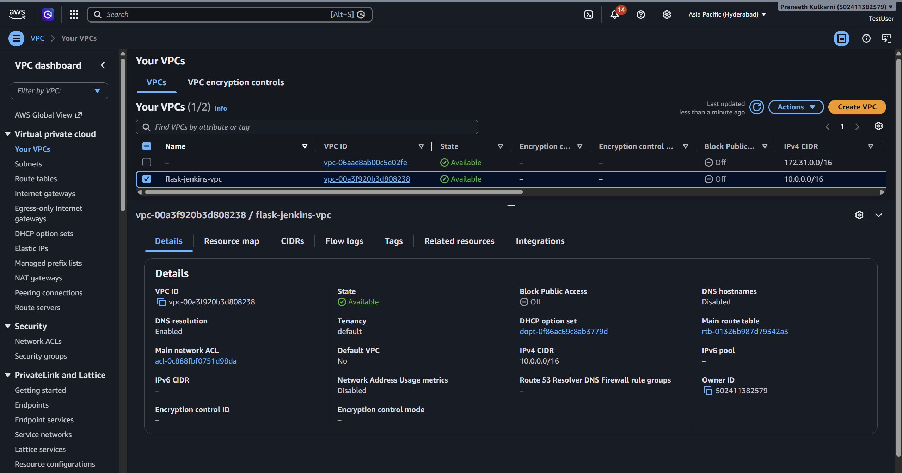
*VPC created — 10.0.0.0/16*

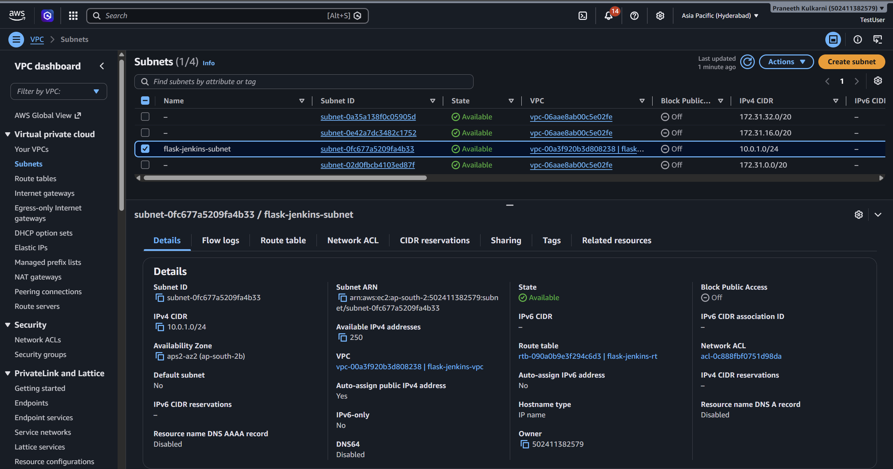
*Public subnet created — 10.0.1.0/24*

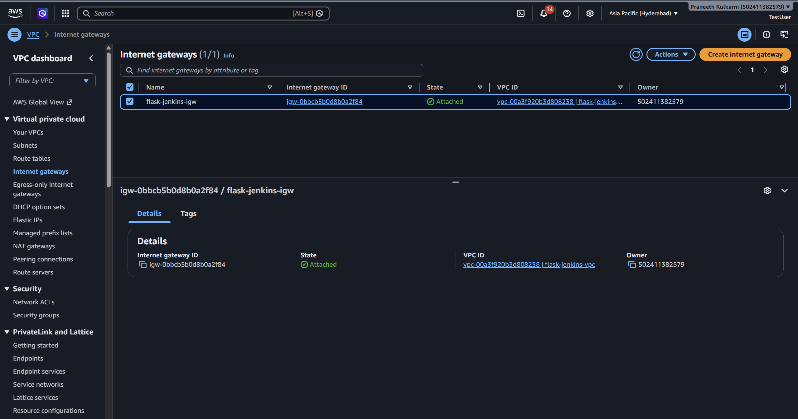
*Internet Gateway attached to the VPC*

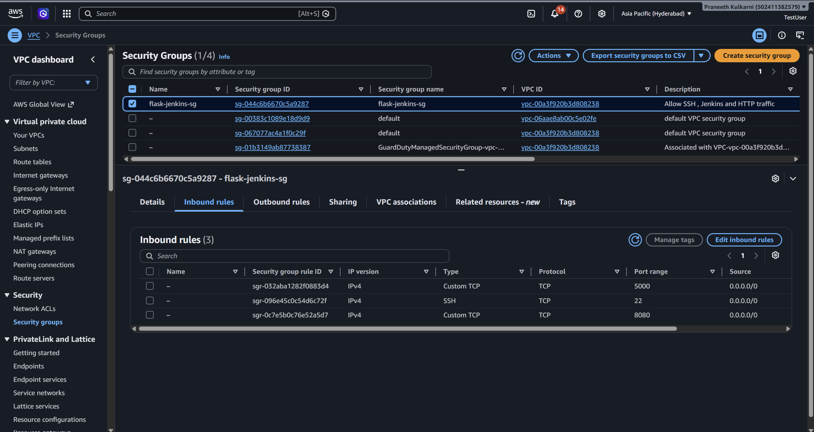
*Security Group — ports 22, 8080, 5000 opened*

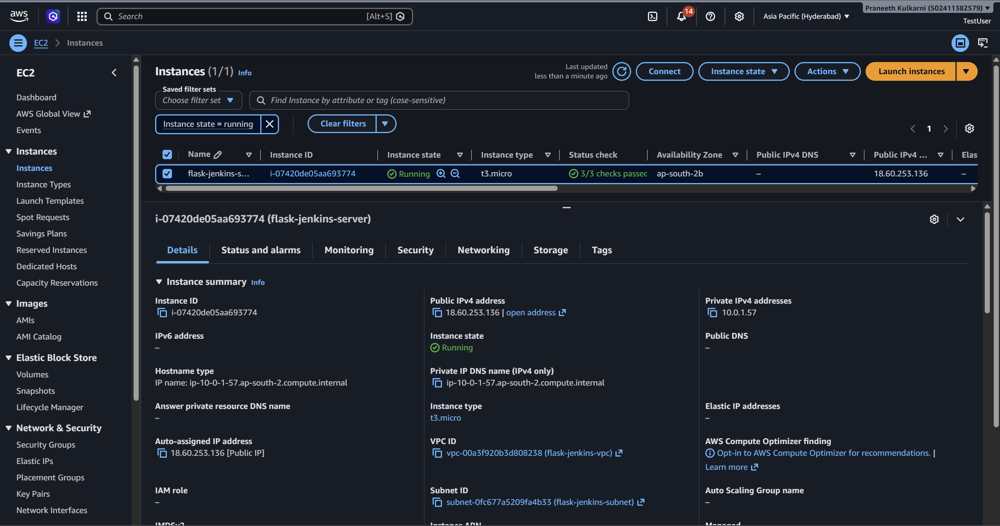
*EC2 instance running (t3.micro, Ubuntu 22.04)*

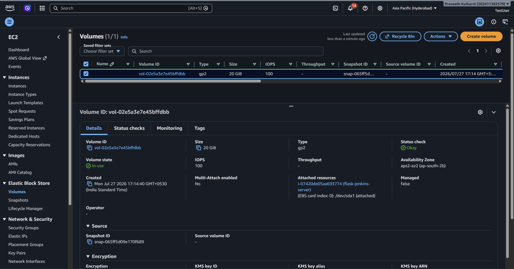
*20GB gp3 root volume attached*

---

## How to Deploy

### Prerequisites
- AWS CLI configured (`aws configure`)
- Terraform installed
- SSH key pair at `~/.ssh/flask-key`

### Step 1 — Provision Infrastructure

```bash
cd terraform/
terraform init
terraform plan
terraform apply
```

After apply completes, terminal prints:

```
ec2_public_ip  = "x.x.x.x"
jenkins_url    = "http://x.x.x.x:8080"
flask_url      = "http://x.x.x.x:5000"
```

The EC2 instance auto-installs Docker, Swap, and Jenkins via `user_data.sh` on first boot. Wait ~3 minutes.

### Step 2 — Unlock Jenkins

```bash
# SSH into EC2
ssh -i ~/.ssh/flask-key ubuntu@<ec2-ip>

# Get Jenkins initial password
docker exec jenkins cat /var/jenkins_home/secrets/initialAdminPassword
```

Open `http://<ec2-ip>:8080` → paste password → install suggested plugins → create admin user.

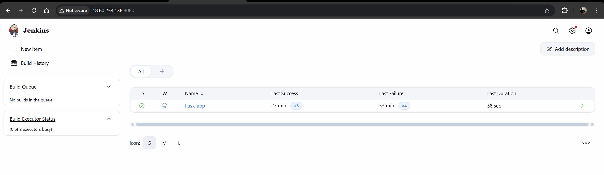
*Jenkins dashboard home page after login*

### Step 3 — Create Pipeline Job

1. Jenkins → **New Item** → **Pipeline** → OK
2. Scroll to **Pipeline** section:
   - Definition: `Pipeline script from SCM`
   - SCM: `Git`
   - Repository URL: `https://github.com/praneethk2401/2-tier-flask-app.git`
   - Branch: `*/main`
   - Script Path: `app/Jenkinsfile`
3. Save → **Build Now**

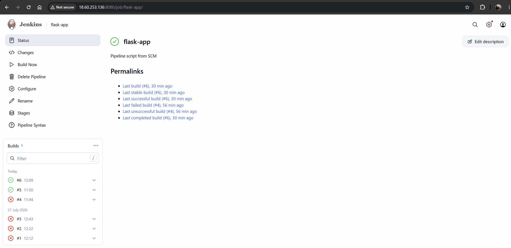
*Flask-app pipeline job configured in Jenkins*

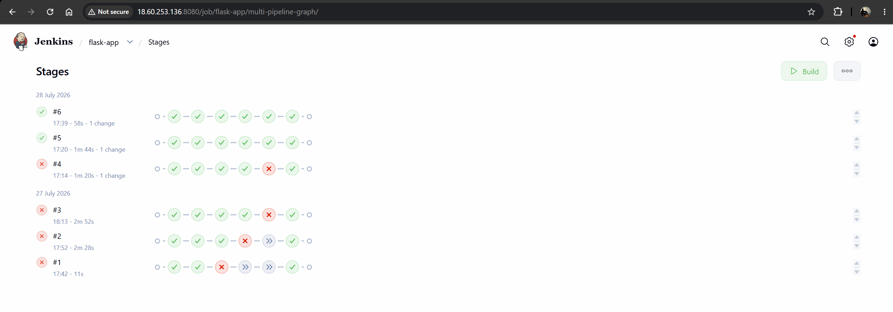
*Pipeline build triggered — build status view*

### Step 4 — Verify Pipeline Success

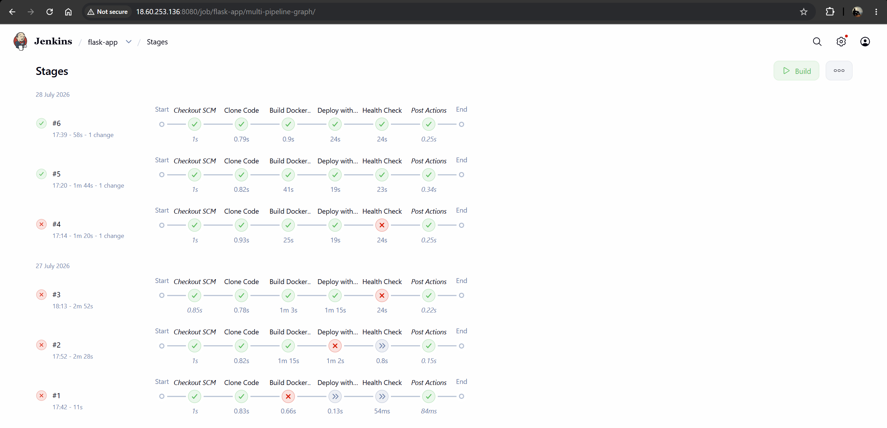
*Stage View — all 4 stages green: Clone Code, Build Docker Image, Deploy with Docker Compose, Health Check*

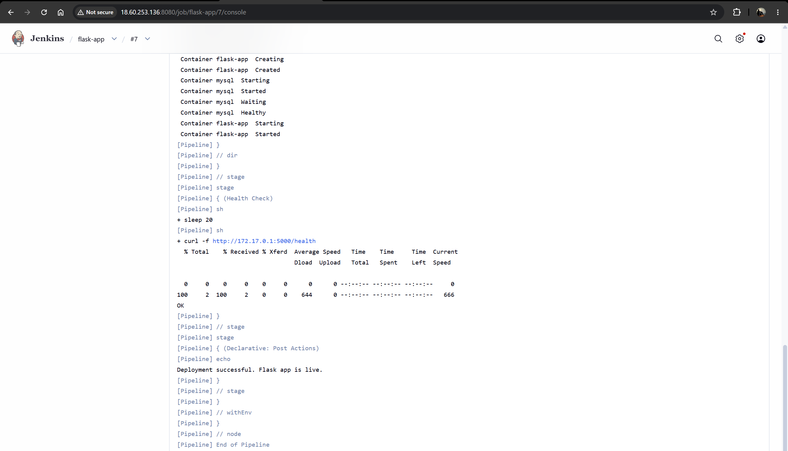
*Console Output — `curl → OK`, `Deployment successful. Flask app is live.`, `Finished: SUCCESS`*

### Step 5 — Access Flask App

Open `http://<ec2-ip>:5000` in browser.

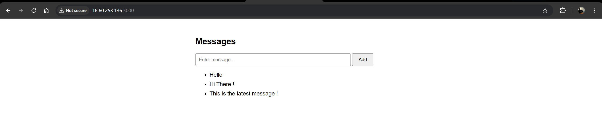
*Flask app running in browser at port 5000 — Messages page with data persisted from MySQL*

---

## CI/CD Pipeline Stages

```
Stage 1: Clone Code
  → Jenkins pulls latest code from GitHub

Stage 2: Build Docker Image
  → Reads Dockerfile → builds flask-app:latest image

Stage 3: Deploy with Docker Compose
  → Stops old containers
  → Starts fresh Flask + MySQL containers
  → MySQL health check ensures DB ready before Flask starts

Stage 4: Health Check
  → Hits /health endpoint
  → Returns OK → pipeline passes
```

---

## Running Containers

After successful pipeline run:

```bash
docker ps
```

Expected output:

```
CONTAINER ID   IMAGE                  STATUS         NAMES
xxxxxxxxxxxx   jenkins/jenkins:lts    Up x hours     jenkins
xxxxxxxxxxxx   flask-app:latest       Up x minutes   flask-app
xxxxxxxxxxxx   mysql:8.0              Up x minutes   mysql
```

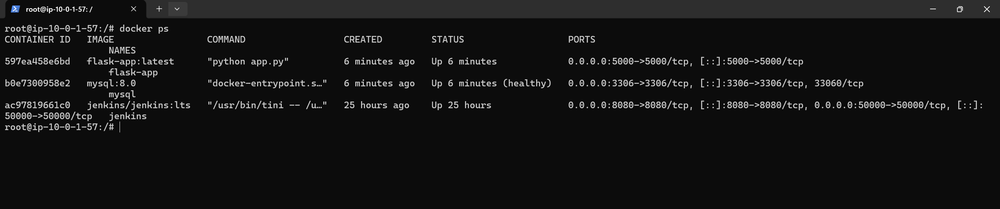
*SSH terminal — `docker ps` with jenkins, flask-app, and mysql all running*

---

## GitHub Repository

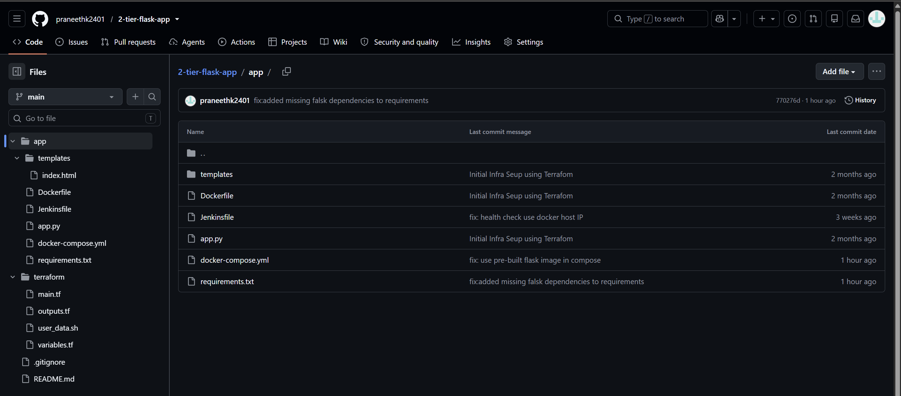
*Clean file structure*

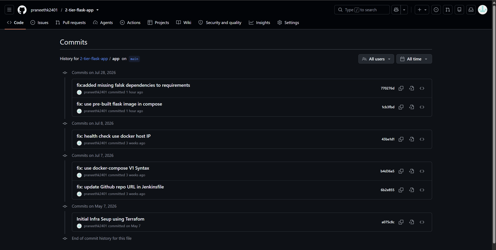
*Commit history*

---

## Key Design Decisions

**Why Jenkins in Docker instead of native install?**
Jenkins GPG key issues on Ubuntu 22.04 made native install unreliable. Running Jenkins as a Docker container bypasses OS-level package management entirely — more portable, easier to manage.

**Why custom VPC instead of default?**
Default VPC is shared and pre-configured. Custom VPC gives full control over networking — subnet CIDR, routing, and security boundaries. Better practice for production-like environments.

**Why Flask over Java/Node.js?**
Flask is lightweight, minimal setup, and produces small Docker images (~200MB vs 500MB+ for Spring Boot). Ideal for demonstrating DevOps concepts without application complexity getting in the way.

**Why Docker Compose for orchestration?**
Simple 2-container setup (Flask + MySQL) with health checks and networking. Kubernetes would be over-engineered for this scope — Docker Compose is the right tool at this scale.

---

## Destroy Infrastructure

```bash
cd terraform/
terraform destroy
```

One command removes all AWS resources. No manual cleanup needed.

---

## Challenges Solved

| Challenge | Solution |
|---|---|
| Jenkins GPG key failure on Ubuntu 22.04 | Switched to Dockerized Jenkins |
| EC2 disk full during Docker builds | Added 20GB `root_block_device` in Terraform |
| Jenkins can't run Docker commands | Mounted `/var/run/docker.sock` into container |
| `t2.micro` not available in `ap-south-2` | Used `t3.micro` instead |
| VPC/Security Group subnet mismatch | Explicitly set `subnet_id` on EC2 resource |
| Out of memory during builds | Added 2GB swap in `user_data.sh` |
| Health check failing from Jenkins container | Used Docker host IP `172.17.0.1` instead of `localhost` |

---

## Author

**Praneeth Kulkarni**
Associate Software Engineer → Cloud/DevOps Engineer

- GitHub: [github.com/praneethk2401](https://github.com/praneethk2401)
- LinkedIn: [linkedin.com/in/praneethkulkarni](https://linkedin.com/in/praneethkulkarni)
